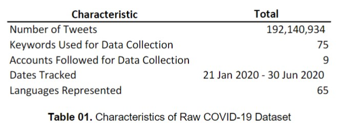
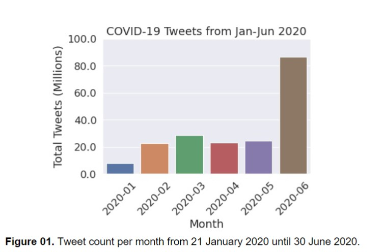
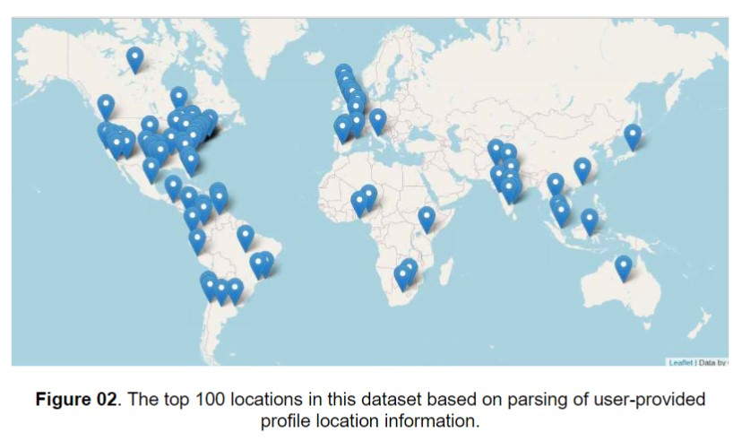
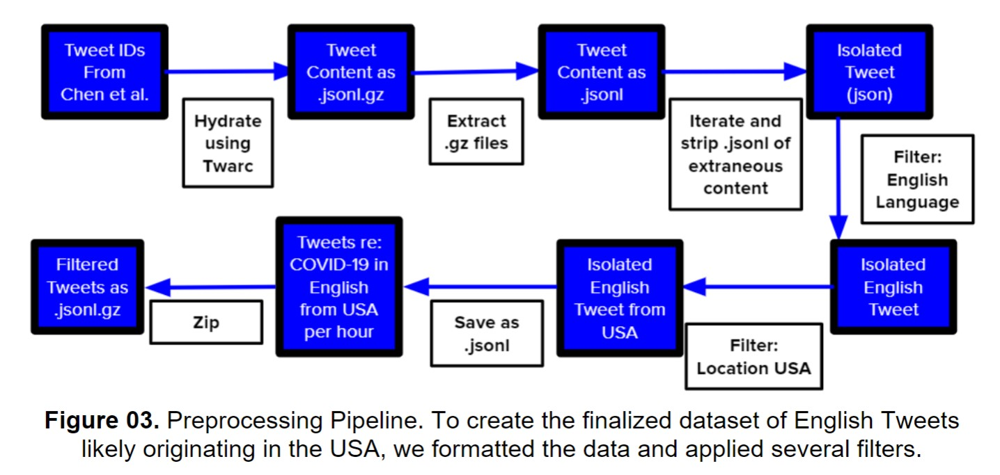

# COVID-19-Twitter-Analysis

Coronavirus disease 2019 (COVID-19), caused by the novel coronavirus SARS-CoV-2, is an acute respiratory infection first reported in Wuhan, China, in late 2019. [[1]](#1) In the United States, public perception of the resulting pandemic has been shaped by a myriad of factors, including the federal response; official communications from government agencies; socio-demographic variables; state-level policies; partisan news media; and social media. [[2]](#2), [[3]](#3) The proliferation of misinformation in particular is detrimental to efforts in containing the spread of the virus, and it has been linked to effects such as vaccine hesitancy and reduced likelihood of compliance with public health guidelines. [[4]](#4) Better understanding the nature and etiology of COVID-19 public perception can aid in the development of more effective strategies to produce, target, and disseminate health information to diverse populations. Therefore, the goal of this project is to analyze publicly available Twitter data using sentiment analysis techniques and network analysis methods to generate insights into public perception of COVID-19 in the United States. 

Because misinformation is somewhat imprecisely defined in the academic literature, we chose to focus our analysis on hydroxychloroquine, which was introduced as a Twitter hashtag during initial data collection and was widely touted as a potential COVID-19 therapeutic despite study limitations and methodological concerns surrounding the initial supporting studies. [[5]](#5) Understanding the possible relationship between microblogging communications and public perception may provide insight into the types of communications that increase compliance with government recommendations and public health guidelines. Furthermore, characterizing “misinformation” and tracking its propagation through social networks can inform strategies to prevent the spread of inaccurate information during public health crises. 

## Dataset

This dataset is composed of publicly-available Twitter data (Tweet IDs) associated with SARS-CoV-2 from late January through June 2020. [[6]](#6) The Tweet IDs are sourced from the GitHub repository _COVID-19 Tweet IDs_, which used both the Twitter streaming API and search API to gather historic and real-time Tweet IDs according to specific COVID-19 keywords and user accounts of interest. Although this dataset is volume-limited at the time of stream/search and subject to fluctuations in internet quality, it provides almost 200 million COVID-19 Tweets to analyze.

### Keywords

We observe a slight delay in the addition of keywords after nomenclature is formally introduced, which suggests that the earliest Tweets captured in the dataset under a particular keyword might not be representative of some of the earliest topical Tweets. For instance, the World Health Organization (WHO) released a statement on 11 February 2020 declaring official names for the virus that causes the novel coronavirus disease as well as the disease it causes. [[7]](#7) These terms (COVID-19 and SARS-CoV-2) were not added to the keyword list until 16 February 2020 and 06 March 2020, respectively, and some derivatives of these terms (COVIDー19, COVID__19) were not added until later. [[8]](#8)

### Monthly Totals

The Tweet IDs were hydrated using Twarc, resulting in Tweet objects stored in gzipped JSON Lines files. [[9]](#9) Plotting the total Tweets per month from January to June 2020 reveals that the most Tweets were posted in June of 2020 (over 80 million of the 192 million total). The fewest Tweets were posted in January (only 7,708,262), but this is expected because data collection didn’t occur until later in the month and the virus hadn’t spread widely yet.

### Languages

Tweets in this dataset are classified as one of 65 languages or ‘undefined’. The most common Tweet language is English (63.56%), which suggests that COVID-related events that unfolded in countries where the primary language is not English may be underrepresented in these Tweets.

### Locations

There are several ways to elucidate a Tweet’s location of origin: (1) geo-tagging; (2) profile location; and (3) location data given in the Tweet text itself. Twitter allows users to geo-tag Tweets at the time of posting, which adds latitude and longitude data to the Tweet object, but this option is only implemented by an estimated 0.85% to 2.0% of users. [[10]](#10), [[11]](#11) Figure 02 was generated by decoding the approximate coordinates of the user profile location using GeoPy, then visualizing the results on an interactive map using Folium. [[12]](#12), [[13]](#13)

These may not necessarily be representative of the top locations where COVID-19 Tweets have originated. This is often due to the flexibility of user inputs resulting in variability in the raw location string (e.g., ‘United States’ and ‘USA’ are considered separate locations in the count). It was observed, however, that variability also arose though subtle variations in character or diacritic usage (‘Mexico’ vs. ‘México’),   the inclusion of differing combinations of city, state, and/or country information (‘San Francisco, CA’ vs. ‘San Francisco, CA, USA’), and the inclusion or exclusive use of flag emoji (‘Australia’ vs. ‘Australia :australia:’ vs. ‘:australia:’). We use this information to develop a location processing pipeline used in later visualizations.

## Preprocessing Pipeline

Due to Twitter’s Terms of Service (TOS), the dataset from Chen, et. al., is provided as a collection of Tweet IDs. [[8]](#8)  It is important to note that the process of hydrating Tweets, or extracting the Tweet object from the Tweet ID, is lossy, so deleted or protected Tweets are no longer accessible through a Twitter API call. In version 1 of this dataset, it was estimated that ~6% of the Tweets were inaccessible at the time of hydration. [[8]](#8)

Our aim was to create a dataset of English Tweets originating from the United States. To achieve this, we captured all Tweets with the English language tag (‘lang’ = ‘en’) and used that dataset to identify the best way to efficiently filter the Tweets based on location.

### Geolocating Tweets

Carmen is a library developed at Johns Hopkins University for geolocating tweets for public health analysis. [[14]](#14), [[15]](#15) Given a Tweet, Carmen will return Location objects that represent a physical location. Carmen uses both coordinates along with other information in a Tweet to make geolocation decisions. This library is designed to infer locations from place, coordinate, and user profile information along an Earth --> Country --> State --> County --> City hierarchy with the use of frequency statistics and known aliases. [[15]](#15) This library allowed us to isolate more Tweets for our USA dataset than filtering based on explicitly available Tweet JSON information alone.

### Finalized Dataset

The finalized dataset consisted of 17,989,581 English Tweets likely originating from the United States. These data represent approximately 8% of the original dataset.

We hypothesized that January and February 2020 would have the lowest volume of Tweet data per unit time containing COVID-19 keywords. English is the most prominent language captured in this dataset (representing over 60% of all Tweets as of version 9), but non-English speaking countries were most affected in the early months of the pandemic. [[6]](#6) In addition, the WHO hesitated to declare COVID-19 a pandemic until almost mid-March, so we predicted that Tweet volume would begin to rise in March 2020. These predictions were confirmed upon further analysis.

Hashtags are user-generated entities that give context or provide keywords for a Tweet. From our COVID-19 dataset, we determined the top 15 hashtags used from January –June 2020, then excluded hashtags containing the strings ‘covid’ or ‘coronavirus’ (because that is the basis of the dataset). The resulting eight hashtags were: 

* #WearAMask
* #CoverYourFreakinFace
* #pandemic
* #China
* #Fl
* #SocialDistancing
* #masks
* #TrumpKillsFlorida

If we were to organize these hashtags into topics, half of them pertain to public health efforts to stop the spread of the virus, two of them are neutral, and two specifically reference Florida. Florida was notably an ‘epicenter of COVID-19 cases.’  [[16]](#16) We anticipate that the counts on these hashtags would be much higher with further consolidation and processing of the hashtag text.

### Location Processing

Prior to ranking the locations in this data, we first removed all emoji; made the text lowercase; replaced all accented characters using Unidecode (which has manual character mappings and more robust/intuitive handling of diacritical marks); and removed extraneous whitespace. [[17]](#17) A count of the preprocessed locations resulted in fewer misclassifications despite the heterogeneity in expression of user profile location data. We then used GeoPy to classify this processed data into standardized geolocations and store it using a Python dictionary.

From our work, the resulting dictionary of (key, value) = (standardized geolocation information, [processed user profile locations]) pairs characterizing the data prompted the question: If we were to flip the key, value pairs and consolidate the dictionary, would it reveal the number of user locations of the same origin that aren’t classified as such? We ran this mini-experiment, which revealed that our top 100 list of locations from the Twitter data was actually a top 72 list: almost 30 locations were still classified as distinct from their correct geolocation classifications, even in spite of the preprocessing and standardization.

## Data Cleaning for Sentiment Analysis

## Investigating Misinformation: Hydroxychloroquine Tweet Analysis

## Hydroxychloroquine Twitter Network Analysis

 

## References

<a id="1">[1]</a> N. Zhu et al., “A novel coronavirus from patients with pneumonia in China, 2019,” N. Engl. J. Med., vol. 382, no. 8, pp. 727–733, Feb. 2020.</a>

<a id="2">[2]</a> J. V. Lazarus et al., “COVID-SCORE: A global survey to assess public perceptions of government responses to COVID-19 (COVID-SCORE-10),” PLoS One, vol. 15, no. 10 October, Oct. 2020.</a>

<a id="3">[3]</a> K. M. C. Malecki, J. A. Keating, and N. Safdar, “Crisis Communication and Public Perception of COVID-19 Risk in the Era of Social Media,” Clin. Infect. Dis., vol. 72, no. 4, pp. 697–702, Feb. 2021.</a>

<a id="4">[4]</a> J. Roozenbeek et al., “Susceptibility to misinformation about COVID-19 around the world: Susceptibility to COVID misinformation,” R. Soc. Open Sci., vol. 7, no. 10, Oct. 2020.</a>

<a id="5">[5]</a> P. Bansal et al., “Hydroxychloroquine: a comprehensive review and its controversial role in coronavirus disease 2019,” Ann. Med., vol. 53, no. 1, pp. 117–134, 2020.</a>

<a id="6">[6]</a> E. Chen, K. Lerman, and E. Ferrara, “Tracking social media discourse about the COVID-19 pandemic: Development of a public coronavirus Twitter data set,” JMIR Public Heal. Surveill., vol. 6, no. 2, p. e19273, Apr. 2020.</a>

<a id="7">[7]</a> “Naming the coronavirus disease (COVID-19) and the virus that causes it.” [Online]. Available: https://www.who.int/emergencies/diseases/novel-coronavirus-2019/technical-guidance/naming-the-coronavirus-disease-(covid-2019)-and-the-virus-that-causes-it. [Accessed: 05-May-2021].</a>

<a id="8">[8]</a> E. Chen, E. Lerman, and K. Ferrara, “COVID-19-TweetIDs,” 2020. [Online]. Available: https://github.com/echen102/COVID-19-TweetIDs. [Accessed: 05-May-2021].</a>

<a id="9">[9]</a> “DocNow/twarc: A command line tool (and Python library) for archiving Twitter JSON.” [Online]. Available: https://github.com/DocNow/twarc. [Accessed: 07-May-2021].</a>

<a id="10">[10]</a> L. Sloan and J. Morgan, “Who tweets with their location? Understanding the relationship between demographic characteristics and the use of geoservices and geotagging on twitter,” PLoS One, vol. 10, no. 11, Nov. 2015.</a>

<a id="11">[11]</a> “Twitter Developer Tutorial: Tweet geospatial metadata,” 2021. [Online]. Available: https://developer.twitter.com/en/docs/tutorials/tweet-geo-metadata. [Accessed: 08-May-2021].</a>

<a id="12">[12]</a> “Welcome to GeoPy’s documentation! — GeoPy 2.1.0 documentation.” [Online]. Available: https://geopy.readthedocs.io/en/stable/. [Accessed: 09-May-2021].</a>

<a id="13">[13]</a> “Folium — Folium 0.12.1 documentation.” [Online]. Available: https://python-visualization.github.io/folium/. [Accessed: 09-May-2021].</a>

<a id="14">[14]</a> “mdredze/carmen-python: Geolocation for Twitter.” [Online]. Available: https://github.com/mdredze/carmen-python. [Accessed: 09-May-2021].</a>

<a id="15">[15]</a> M. Dredze, M. J. Paul, S. Bergsma, and H. Tran, “Carmen: A Twitter Geolocation System with Applications to Public Health.” </a>

<a id="16">[16]</a> B. Sen-Crowe, M. Sutherland, M. McKenney, and A. Elkbuli, “The Florida COVID-19 mystery: Lessons to be learned,” American Journal of Emergency Medicine, vol. 0, no. 0. W.B. Saunders, 2020.</a>

<a id="17">[17]</a>  S. Burke and T. Solc, “Unidecode · PyPI,” 2021. [Online]. Available: https://pypi.org/project/Unidecode/. [Accessed: 09-May-2021].</a>
